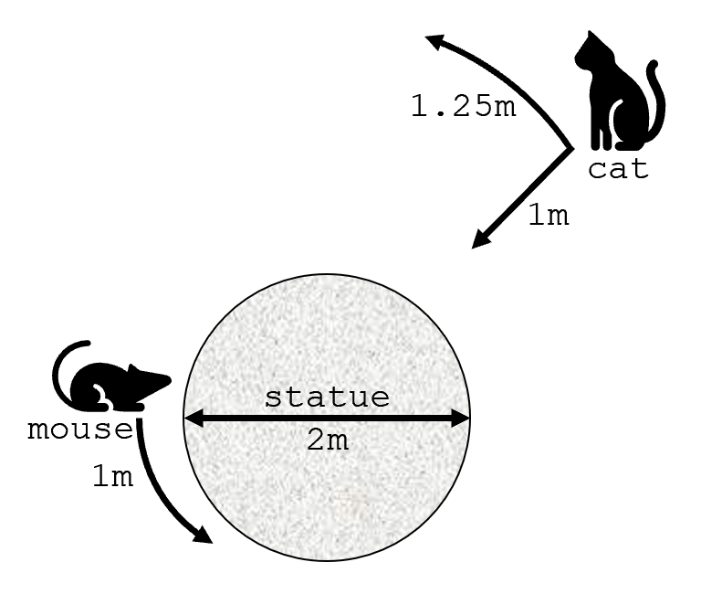

# HW: Cat and Mouse

Simulate a game of cat and mouse.  The program should print the positions of the cat and mouse at each time step and the result of the simulation.

## Background
A cat watches a mouse run around the base of a statue of a Gopher. Over the course of one minute, the mouse moves one meter in a counterclockwise circle around the statue's base, which is circular and two meters in diameter. At the end of one minute, the cat pursues the mouse as follows: if the cat can see the mouse, the cat moves one meter toward the statue; if the cat cannot see the mouse, the cat moves 1.25 meters in counterclockwise circle around the statue.

The cat would like to catch the mouse. The mouse may, by accident of initial conditions, manage to keep completely out of sight of the cat, since both the cat and the mouse are moving counterclockwise. If this happens, the cat will eventually get bored and give up.



## Problem
Write a Go program that generalizes and simulates this situation to determine if the cat catches the mouse.

The program should ask the user for:

* the parameters of the problem:
  * the speeds of the cat towards and around the statue
  * the attention span of the cat
  * the speed of the mouse around the statue
  * the diameter of the statue
* the initial positions:
  * the radius and angle of the cat
  * the angle of the mouse

It should then simulate the chase using the rules described above to determine how the cat and mouse move, with the cat moving first. The program should print the position of the cat and mouse after each move, followed by the result of the chase.

### Decompostion
Most problems are easier to solve when they are decomposed into smaller or simpler problems ("subproblems"). This problem has several subproblems into which it can be decomposed.  Thus, the program should be composed of a collection of functions, each of which solves a single subproblem.

While most of the decomposition is up to you, we require that you implement two functions:

* `Main(r io.Reader, w io.Writer)` which should orchestrate the input, processing, and output operations.
* `CatCatchesMouse(p Parameters, c Cat, m Mouse) (bool, []Cat, []Mouse)` which takes valid problem parameters and cat and mouse positions as arguments and runs the simulation, returning a Boolean value for whether or not the cat catches the mouse and records of the positions of the cat and mouse at each step.

## Input and Output Formatting

### Input

Input to the program is supplied via the standard input stream (e.g. in the terminal) in the following order:

* cat's speed toward statue (meters per minute)
* cat's speed around statue (meters per minute)
* cat's attention span (minutes)
* mouse's speed  (meters per minute)
* statue's diameter (meters)
* cat's radius (meters)
* cat's angle (degrees)
* mouse's angle (degrees)

Each value is terminated by a newline character (e.g. when the user presses the Enter key).

If a value is invalid, you should report the error and re-prompt.

### Output

Output from the program should be printed to the standard output stream (e.g. to the terminal).  The output includes the prompts for user input, the position data from the simulation, and a final line which indicates the result.

The position data from the simulation should be formatted as a table:

```txt
| time | cat radius | cat angle | mouse angle |
| ---- | ---------- | --------- | ----------- |
|    0 |          8 |        67 |       53.09 |
|  ... |        ... |       ... |         ... |
```

The final line of output should describe the result of the simulation, either:

* `The cat caught the mouse at t=<time>.`
* `The cat gave up.`

### Example

A run of the program might look like this:

```txt
$ go run cat_and_mouse.go
cat speed toward statue: x
invalid input.
cat speed toward statue: 1
cat speed around statue: 1.25
     cat attention span: 30
            mouse speed: 1
        statue diameter: 2
             cat radius: 4
              cat angle: 0
            mouse angle: 57

| time | cat radius | cat angle | mouse angle |
| ---- | ---------- | --------- | ----------- |
|    0 |     4.0000 |    0.0000 |     57.0000 |
|    1 |     3.0000 |    0.0000 |    114.2958 |
|    2 |     3.0000 |   23.8732 |    171.5916 |
|    3 |     3.0000 |   47.7465 |    228.8873 |
|    4 |     3.0000 |   71.6197 |    286.1831 |
|    5 |     3.0000 |   95.4930 |    343.4789 |
|    6 |     3.0000 |  119.3662 |     40.7747 |
|    7 |     3.0000 |  143.2394 |     98.0705 |
|    8 |     2.0000 |  143.2394 |    155.3662 |
|    9 |     1.0000 |  143.2394 |    212.6620 |
|   10 |     1.0000 |  212.6620 |    212.6620 |

The cat caught the mouse at t=10.
```

## Requirements

[Get the starter code.](starter.zip)

Your program must include the following functions:

* `main()` - provided in the starter code
* `Main(r io.Reader, w. io.Writer)`
* `CatCatchesMouse(p Parameters, c Cat, m Mouse) (bool, []Cat, []Mouse)`

Your program *really ought to* include other functions, too.

Your program must define the `struct` types:

* `Parameters` with fields in this order:
  * cat's speed toward statue (meters per minute)
  * cat's speed around statue (meters per minute)
  * cat's attention span (minutes)
  * mouse's speed  (meters per minute)
  * statue's diameter (meters)
* `Cat` with fields:
  * `radius`
  * `angle`
* `Mouse` with field:
  * `angle`

### Testing

You must write tests that cover at least 90% of the statements in your program.

`Main` has `io.Reader` and `io.Writer` parameters so that you can test functions that expect user input by providing input via those interfaces instead of the standard input and output streams.  The `fmt` package has functions like `fmt.Fscan` that allows you to read from an `io.Reader` and `fmt.Fprint` that allows you to write to an `io.Writer`.

*Tip: Because short and simple functions are easier to test than long and complex functions, the more decomposition you do the easier it will be to achieve a high level of useful coverage.*

## Submission

Submit only these files to Gradescope:

* `cat_and_mouse.go`
* `cat_and_mouse_test.go`
