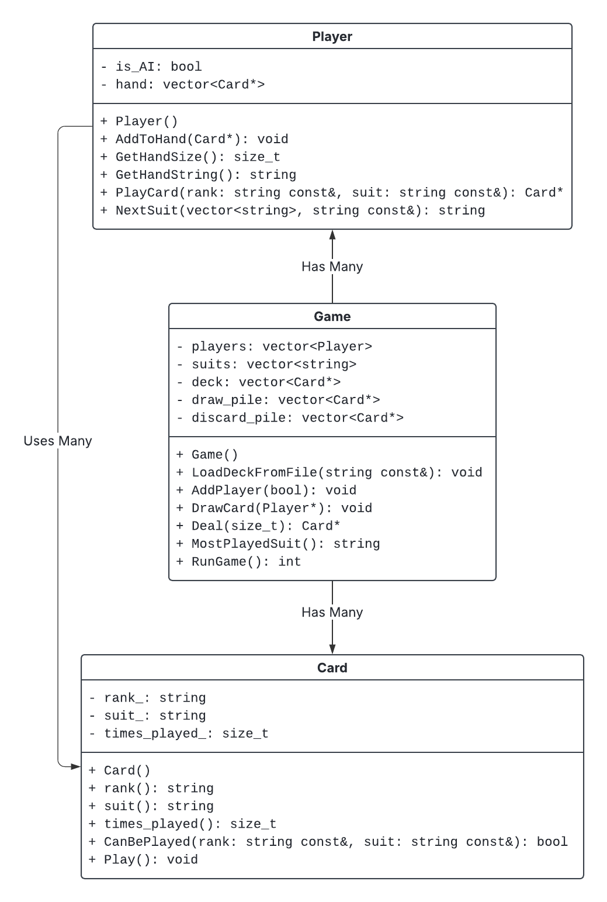

# HW: Crazy 8s

## Overview

### Objectives

* Practice with classes (constructors, getters, setters, and encapsulation).
* Working with dynamic memory and pointers.
* Using vectors.
* Additional practice with file I/O.
* Additional practice with exceptions.

### Guidelines for Homework

* This and all other homeworks are individual coding practice assignments.
* Do not show your code to other students.
* Do not look at the code of other students.
* Do not share your code with other students.
* Do not use AI tools.

If you have questions about this assignment, talk to a Peer Teacher, a TA, or an instructor.

* Go to Gradescope to submit your code
* Ask questions on the Q\&A board.
  * Look there to see if someone has already asked your question.
  * It is very rare that a student's question is unique. Ask there, and everyone can benefit from the answer.
  * If you know the answer, go ahead and answer it yourself!
  * Do not post HW code publicly. Make a **private** post to Instructors and TAs on the Q\&A board..
    * Do not post screenshots of code.

If you know about another student who is sharing their code with other students (or in any other way is violating the Aggie Code of Honor), you should report them to the instructor or [report them to the AHSO](https://cm.maxient.com/reportingform.php?TexasAMUniv&layout_id=11). If you become aware of academic dishonesty, you are expected to report it through the appropriate channels.

### Introduction

Crazy 8s is a simple classic card game which is very similar to Uno. If you aren't familiar with the game, you may want to [read the section Rules of Crazy 8s](#rules-of-crazy-8s) first. In this homework, you will create a C++ version of the game, which you can play against friends, or against a (very basic) artificial intelligence. Along the way, you'll get to practice your skills at handling dynamic memory and object-oriented programming.

## Getting Started

* [Get the starter code](https://drive.google.com/file/d/1Io03LsXjUS3KNt-GpHMHpEO18Td6VzVi/view?usp=drive_link)
  * `game.h` and `game.cpp`: Manages the game, keeps track of all players and cards.
  * `player.h` and `player.cpp`: Players of the game, who may be humans or AIs.
  * `card.h` and `card.cpp`: Cards used to play the game.
  * `main.cpp`: this file is useful for testing your code locally and contains a menu for setting up a game. You do not need to modify this file.
  * `starter_decks/*`: Deck files to use for testing.  Contains both valid and invalid examples.
* Review the code.
  * Read header and source files.
  * Compile and run the initial state of the starter code.
  * Review the organization of the classes. The UML class diagram below shows the relationships bewteen the `Game`, `Player`, and `Card` classes used for this program.



## Recommendations

* **Read the entire document first** as class and function relationships can get confusing if you aren't careful.
* Implement only the methods/functions you need at the moment. You don't have to get everything done at once (it is not a good strategy to follow anyways).
* Implement the classes in the following order:
  1. `Card`
  2. `Player`
  3. `Game`
* You can utilize `main.cpp` to test the functions that you have implemented so far. You can also create a separate testing file with its own `main` function (strongly recommended).
* [Refer to the appendix](#appendix) as needed.
* Plan and **think before you code** (write test cases first).
* Tips for working with the autograder:
  * The autograder is picky about your output exactly matching what is given in the requirements and/or sample execution. A resource like [Diffchecker](https://www.diffchecker.com/) may be helpful for figuring out where your output differs from Gradescope's when they look similar.
  * If an autograder test is giving you no output at all, it usually means that your code is crashing (e.g. by dereferencing an invalid pointer).
  * If a test timesout, it is possible that your code is stuck waiting for user input after the autograder has given you all the input it has (e.g. you're rejecting a valid input)
* **Test (locally) early and often.**

## Requirements

### Allowed Includes

* `<cstddef>`
* `<fstream>`
* `<iostream>`
* `<sstream>`
* `<stdexcept>`
* `<string>`
* `<vector>`
* `"card.h"`
* `"game.h"`
* `"player.h"`

### General

* Exceptions should have meaningful descriptions.
* The program must compile without warnings or errors.

### main.cpp

* Used for actually playing the game.
* Do not modify it (or do, at your own peril).
* Do not submit it (it will be ignored).

### Classes

* You must implement three classes:
  1. `Card`
  2. `Player`
  3. `Game`
* Constructors must use [member initialization lists](https://en.cppreference.com/w/cpp/language/constructor).

#### Card

* `Card::Card(rank: string, suit: string)`
  * Construct a new instance of `Card` with the given rank and suit.
  * Throw a `std::invalid_argument` exception if rank or suit are empty or contain non-alphanumeric characters (i.e. anything other than letters and numbers)
* `Card::rank(): string`
  * The rank of the card.
* `Card::suit(): string`
  * The suit of the card.
* `Card::times_played(): size_t`
  * The number of times the card has been played.
* `Card::CanBePlayed(rank: string const&, suit: string const&): bool`
  * Whether the card can be played on a card with the given rank and suit.
* `Card::Play(): void`
  * Increment the number of times the card has been played.
  * This method is provided (already implemented) in `card.h`.

#### Player

* `Player::Player(is_AI: bool)`
  * Construct a new instance of `Player`.
* `Player::AddToHand(card: Card const*): void`
  * Add the card to the player's hand.
  * The hand should be ordered from least recently added to most recently added (i.e. new cards should go at the back of the hand)
* `Player::GetHandSize(): size_t`
  * The number of cards in the player's hand.
* `Player::GetHandString(): string`
  * The player's hand as a string.
  * Cards should be listed from the front of the hand (oldest card) to the back (newest card)
  * The rank and suit of a card should be separated by a space
  * Consecutive cards should be separated by a comma and a space
  * For example, if the cards in the player's hand are the 8 of Hearts and the 3 of Diamonds, this method should return the string "8 Hearts, 3 Diamonds"
* `Player::PlayCard(rank: string const&, suit: string const&): Card const*`
  * Choose a card to play from the player's hand.  Remove and return it.
  * `rank` and `suit` are those of the active card (the currently showing discarded card).
  * Call the card's `Play` method to increment the number of times the card has been played.
  * Return the null pointer if the player does not play a card.
  * The process of choosing a card to play is different for AI players and for humans:
    * The AI will always play the first card from its hand that it can legally play or draw a card if it has no cards it can play.
    * For human players, you must tell them the current rank and suit and ask them to choose a card to play by entering two strings.
      * Prompt the player to choose again if they choose a card they don't have or a card they have in hand cannot play ([see the sample execution](#sample-execution))
    * Upon playing an 8, the player may change the current suit to any suit in the game
      * Invoke the `NextSuit` method to determine the next suit.
* `Player::NextSuit(suits: vector<std::string> const&, suit: string const&): string`
  * Choose the next suit to declare (after playing an 8 of the given suit).  Return the chosen suit.
  * An AI player will always choose to use the suit of the 8.
    * Do not validate that the chosen suit is one of the given (valid) suits.
  * A human player should be prompted to pick a suit.
    * Validate that the chosen suit is one of the given (valid) suits.
    * Reprompt until player selects a valid suit

#### Game

* `Game::Game()`
  * Construct a new instance of `Game` with all attributes empty.
* `Game::~Game()`
  * Deallocate all cards and players.
  * This method is provided (already implemented) in `game.h`.
* `Game::LoadDeckFromFile(filename: string const&): void`
  * Load a deck from the file with the given name.
  * [Refer to the Data File Format section](#data-file-format), which specifies the format of card information included in the file.
  * When creating a new `Card` object, remember that we are working with dynamic memory. Use the `new` keyword to allocate memory on the heap.
  * Cards read from the file should be added to both the deck and the draw pile
    * Create `Card` objects as you read the lines from the file and use them to populate the `deck` and `draw_pile` attributes.
      * `deck` is a permanent index of all cards and will not change over the course of the game.
      * `deck` should list the cards in the same order that they appear in the file (i.e. the first card in the input file should be at position 0).
      * `draw_pile` keeps track of the cards that have not been drawn yet, and will shrink as cards are drawn during the game.
      * `draw_pile` should list the cards in the opposite order (i.e. the last card in the input file should be at position 0)
      * Cards will be drawn from the end of `draw_pile` (recall that removing from the end of an array/vector is faster than removing from the beginning).
  * Use the card information to initialize the `suits` attribute (a list of all the suits in the deck)
  * Throw a `std::runtime_error` exception if file could not be opened.
  * Throw a `std::runtime_error` exception if the file content does not match the specified format. This includes:
    * A line that is too short or too long (i.e. doesn't have both rank and suit, or has extra information)
    * If the card constructor throws a `std::invalid_argument` exception you should catch it here and throw a `std::runtime_error` exception instead.
* `Game::AddPlayer(is_AI: bool): void`
  * Add a player to the game.
  * Create a new `Player` and add them to the end of `players`
  * When creating a new `Player` object, remember that we are working with dynamic memory. Use the `new` keyword to allocate memory on the heap.
* `Game::DrawCard(player: Player*): void`
  * Draw a card into the player's hand.
  * Move the top card of the draw pile (the last card in `draw_pile`) into the player's hand.
  * If the draw pile is empty, you will need to replenish it before you draw the player their card:
    * If the discard pile has at least two cards then print "Draw pile empty, flipping the discard pile." and then form a new draw pile by leaving just the top card in the discard pile (as a reminder of what was played last) and flipping the rest of the discard pile.
      * The second card from the top of the discard pile will become the bottom card of the draw pile.
      * The bottom card of the discard pile will end up as the top card of the draw pile.
      * In a typical game, we would shuffle the discard pile, but this non-random approach makes testing and debugging easier.
    * Throw a `std::runtime_error` exception if the discard pile contains only one card.
* `Game::Deal(num_cards: size_t): Card*`
  * Discard the top card of the deck, deal the given number of cards to each player.  Return the initially discarded card.
  * First, form a starting discard pile by discarding the top (last) card of the draw pile
  * Then, deal cards from the top of the deck to the players' hands one at a time (use the `DrawCard` method).
    * You should not catch any exceptions thrown by `DrawCard`.
    * If you are unable to draw enough cards for all the players, allow the exception thrown by `DrawCard` to continue being thrown.
  * You should give each player their first card (starting with player 0) before giving any player their second card.
    * You should repeatedly give each player one card, in turn order, until each player has received `num_cards` many cards.
* `Game::MostPlayedSuit(): string`
  * The suit which has been played the most times.
  * Figure out how many times each suit has been played by adding up the `times_played` values for all cards of that suit.
  * In case of a tie, return any of the tied suits.
  * *Hint: the deck contains all the cards in the game, whether they are in the draw pile, the discard pile, or a player's hand.*
* `Game::RunGame(): int`
  * Run the game and return the index of the winning player.
  * You may assume that the game has been set up using `LoadDeckFromFile`, `AddPlayer`, and `Deal`
  * [Refer to the appendix for details on the rules of our version of Crazy 8s](#rules-of-crazy-8s).
  * [Refer to the sample execution](#sample-execution) for examples of the messages you should print.
  * At the start of each turn you should announce "Player &lt;Player #&gt;'s turn!".
  * You should determine which card the player is playing, if any.
  * If the player is playing a card:
    * You should announce the rank and suit of this card.
    * If the card is an 8, you should announce the new suit that the player has chosen.
    * You should add the played card to the top (end) of the discard pile.
  * If the player is drawing a card:
    * You should announce this.
    * You should draw a card and add it to their hand.
    * If there are no more cards to draw, print "Player &lt;Player #&gt; cannot draw a card." and return -1 to indicate a draw (tied game).
      * You will need to catch the exception thrown by `DrawCard` to detect this.
  * Whenever any player has 0 cards remaining in hand, end the game and return the winner.

## Appendix

### Sample Execution

<pre>
Choose a file to load the deck from:
microDeck.txt
Enter number of players:
hi
Please enter a positive number.
0
Please enter a positive number.
2
Is player 0 an AI? (y/n)
q
Please enter y or n.
n
Is player 1 an AI? (y/n)
y
How many cards should each player start with?
none
Please enter a positive number.
5
The initial discard is 7 Hearts.
Player 0's turn!
Your hand contains: 8 Clubs, 7 Spades, 4 Spades, 9 Hearts, 5 Hearts.
The next card played must be a 7 or Hearts.
What would you like to play? (enter "draw card" to draw a card)
8 Hearts
That's not a card you have. Try again.
4 Spades
You can't play that card. Try again.
7 Spades
Player 0 plays 7 Spades.
Player 1's turn!
Player 1 plays 7 Clubs.
Player 0's turn!
Your hand contains: 8 Clubs, 4 Spades, 9 Hearts, 5 Hearts.
The next card played must be a 7 or Clubs.
What would you like to play? (enter "draw card" to draw a card)
8 Clubs
What suit would you like to declare?
Squares
That's not a suit in this deck. Try again.
Spades
Player 0 plays 8 Clubs and changes the suit to Spades.
Player 1's turn!
Player 1 draws a card.
Player 0's turn!
Your hand contains: 4 Spades, 9 Hearts, 5 Hearts.
The next card played must be a 8 or Spades.
What would you like to play? (enter "draw card" to draw a card)
4 Spades
Player 0 plays 4 Spades.
Player 1's turn!
Player 1 plays 8 Hearts and changes the suit to Hearts.
Player 0's turn!
Your hand contains: 9 Hearts, 5 Hearts.
The next card played must be a 8 or Hearts.
What would you like to play? (enter "draw card" to draw a card)
9 Hearts
Player 0 plays 9 Hearts.
Player 1's turn!
Player 1 plays 9 Clubs.
Player 0's turn!
Your hand contains: 5 Hearts.
The next card played must be a 9 or Clubs.
What would you like to play? (enter "draw card" to draw a card)
draw card
Draw pile empty, flipping the discard pile.
Player 0 draws a card.
Player 1's turn!
Player 1 plays 3 Clubs.
Player 0's turn!
Your hand contains: 5 Hearts, 7 Hearts.
The next card played must be a 3 or Clubs.
What would you like to play? (enter "draw card" to draw a card)
draw card
Player 0 draws a card.
Player 1's turn!
Player 1 plays 10 Clubs.
Player 0's turn!
Your hand contains: 5 Hearts, 7 Hearts, 7 Spades.
The next card played must be a 10 or Clubs.
What would you like to play? (enter "draw card" to draw a card)
draw card
Player 0 draws a card.
Player 1's turn!
Player 1 plays 2 Clubs.
Player 1 wins!
The most played suit was Clubs.
</pre>

### Data File Format

* Each line contains a single card.
  * Each line consists of a rank and a suit, separated by a space
* See the data files provided in `starter.zip` for examples.

### Rules of Crazy 8s

There are many different variations of Crazy 8s. To keep the amount of work for the assignment reasonable, we have chosen a basic version of the game. You can [find a 1-minute video explanation of the rules here](https://www.youtube.com/shorts/qTUnq5LM2Kk) which may be helpful. If you'd like to try playing the game yourself, [the online implementation here](https://www.solitaireparadise.com/games_list/crazy-eights.html) is consistent with the rules we use. Note that to simplify the assignment, our version of the game does not involve scoring. The first player to empty their hand simply wins.

The game is played with any deck using ranks and suits. Initially all of the cards in the deck are placed in the draw pile. To make testing and debugging easier, the pile is not shuffled. At the start of the game, the top card of the draw pile is discarded to determine the initial rank and suit. Each player is dealt the same number of cards (this number is specified by the user). The objective of the game is to achieve an empty hand by playing all of your cards.

Players take turns, going around in a circle. On your turn, you may play a card (moving it from your hand to the discard pile) if it matches the current rank or suit. If you do this, the new rank and suit become the rank and suit of the card you played. You can play at most 1 card per turn. If you cannot play a card, or do not wish to do so, you must instead draw a new card from the top of the draw pile and add it to your hand. After drawing a card, your turn ends, even if the newly drawn card is one you would have been able to play. There is no limit on the number of cards that you can have in hand.

As the name of the game suggests, cards of rank 8 are an exception to the usual rules. You may play an 8 on your turn regardless of the current rank and suit. Furthermore, when playing an 8, you may declare a new suit, which can be any suit in the game. For example, you could play the 8 of Spades and declare "Diamonds" as the suit, in which case the next card played would need to be a card of the Diamonds suit (or another 8).

If the draw pile ever runs out of cards, the next time a player needs to draw a card they first flip the discard pile over to form a new draw pile (leaving the top card as a reminder of the current rank and suit). In the unlikely event that it is not possible to form a new draw pile in this way (because all the cards except the top discard are in the players' hands), the game is declared a draw (a tie).

### Useful functions and classes

You may use any of the functionality provided by C++ strings and C++ vectors in your solution. Most students may find the following operations useful:
* `vector`
  * `back()`: Returns the last element of the vector
  * `erase(pos)`: Remove the element of the vector at position `pos`
    * Note, this function takes an "iterator", not an `int`
    * You can obtain an iterator for position `i` in vector `v` using `v.begin()+i`
  * `pop_back()`: Removes the last element of the vector
  * `push_back(elem)`: Adds a new element elem at the end of the vector
  * `size()`: Returns the number of elements in the vector

### How to compile

(*you should have memorized this by now!*)

```sh
g++ -std=c++23 -Wall -Wextra -Weffc++ -pedantic -g -fsanitize=undefined,address *.cpp
```